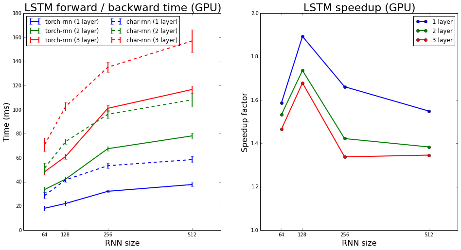
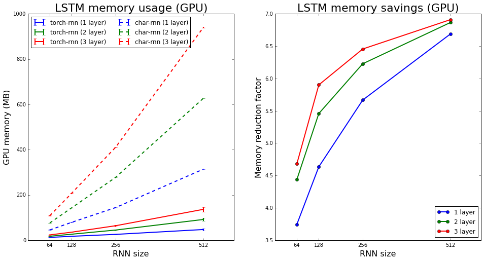

# torch-rnn
torch-rnn provides high-performance, reusable RNN and LSTM modules for torch7, and uses these modules for character-level
language modeling similar to [char-rnn](https://github.com/karpathy/char-rnn).

Compared to char-rnn, torch-rnn is up to **1.9x faster** and uses up to **7x less memory**.

# TODOs
- CPU support
- OpenCL support
- Documentation
  - Dependencies / installation
  - VanillaRNN
  - LSTM
  - LanguageModel
  - preprocess.py
  - train.lua
  - sample.lua

# Setup

# Usage

# Benchmarks

